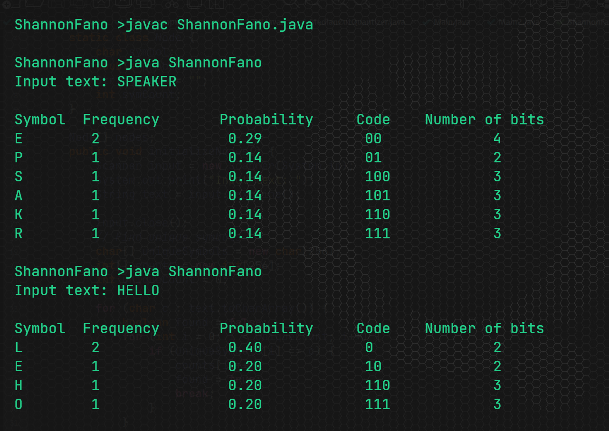

# Shannon-Fano Coding Implementation

A simple Java implementation of the **Shannon-Fano coding algorithm**, a data compression technique that assigns variable-length codes to source symbols based on their probabilities.

## Algorithm Overview

The Shannon-Fano algorithm works by recursively dividing a set of symbols into two groups with probabilities as close to equal as possible.

1.  **Count Frequencies**: The program first reads the input text and counts the frequency of each unique character.
2.  **Calculate Probabilities**: It then calculates the probability of each symbol by dividing its frequency by the total number of characters.
3.  **Sort Symbols**: The symbols are sorted in descending order based on their probabilities.
4.  **Recursive Division**: The core of the algorithm involves a recursive function that partitions the symbols into two groups.
      * The top half of the symbols (with higher probabilities) are assigned a **'0'**.
      * The bottom half of the symbols are assigned a **'1'**.
      * This process continues recursively on each subgroup until all symbols have a unique code.

## 🛠️ Code Structure

  * `ShannonFano.java`: Contains the main logic for the Shannon-Fano algorithm.
      * `Node` class: An inner class that holds information for each character, including the symbol itself, its probability, and its assigned code.
      * `initializeNodes()`: Prompts the user for input, counts symbol frequencies, calculates probabilities, and sorts the nodes.
      * `shannonFano(int start, int end)`: The recursive method that generates the codes by splitting the sorted nodes.
      * `displayCodes()`: Prints a table showing each symbol, its frequency, probability, and the final generated code.
      * `main()`: The entry point of the program, which orchestrates the calls to the other methods.

## 💡 Example

If you input the text `HELLO`, the program will analyze the characters, sort them, and generate the following codes:

| Symbol | Frequency | Probability | Code |
|:---:|:---:|:---:|:---:|
| L | 2 | 0.40 | 0 |
| H | 1 | 0.20 | 10 |
| E | 1 | 0.20 | 110 |
| O | 1 | 0.20 | 111 |

**Note**: The codes generated can vary slightly depending on how the initial partition is made when the sum of probabilities is split. This implementation finds the partition point where the cumulative sum of probabilities is greater than or equal to half the total.

## Output Screenshot

Here’s what the program output looks like:

